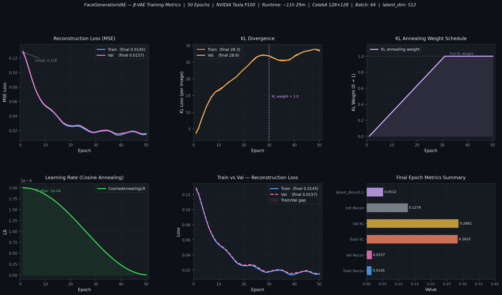

<div align="center">

# FaceGenerationVAE

### β-VAE for photorealistic face generation — trained on CelebA at 128×128 resolution

[](https://python.org)
[](https://pytorch.org)
[](LICENSE)
[](https://www.kaggle.com/code/atandrabharati/facegenerationvae)
[](https://www.comet.com)
[](https://www.kaggle.com/code/atandrabharati/facegenerationvae)

<br/>

*A convolutional β-VAE with linear KL annealing, bilinear upsampling, and a 512-dimensional latent space — generating novel faces by sampling from the prior.*

</div>

---

## Overview

This project implements an **improved Variational Autoencoder (β-VAE)** for face image generation, trained from scratch on the CelebA dataset at **128×128 resolution** with a **512-dimensional latent space**.

Key design choices over a standard VAE:
- **Bilinear Upsample + Conv2d** decoder instead of ConvTranspose2d — eliminates checkerboard artefacts
- **Linear KL annealing** (0 → 1 over 30 epochs) prevents posterior collapse and lets reconstruction dominate early training
- **Clamped reparameterization** for numerical stability throughout 50-epoch runs
- **AdamW + CosineAnnealingLR** for smooth convergence in the second training half

**Key results at epoch 50:**
| Metric | Value |
|--------|:-----:|
| Train reconstruction loss (MSE) | **0.0152** |
| Val reconstruction loss (MSE) | **0.0162** |
| Final KL divergence (per image) | **28.0** |
| Posterior alignment (μ mean) | **≈ 0.000** |
| Posterior alignment (log σ mean) | **≈ −0.063** |
| Training runtime | **~11h 29m (P100)** |

---

## Training Curves

<div align="center">
  
</div>

> Full training log: [`results/training_summary.md`](results/training_summary.md)

---

## Architecture

### Encoder

Strided convolutions progressively compress the image to a spatial bottleneck, then two linear layers produce the variational parameters.

```
Input (3×128×128)
      │
┌─────▼──────────────────────────────────────────────────────────┐
│  ENCODER                                                        │
│  Conv2d(3→64,   k=4, s=2, p=1) → LeakyReLU(0.2) → BN  64×64 │
│  Conv2d(64→128, k=4, s=2, p=1) → LeakyReLU(0.2) → BN  32×32 │
│  Conv2d(128→256,k=4, s=2, p=1) → LeakyReLU(0.2) → BN  16×16 │
│  Conv2d(256→512,k=4, s=2, p=1) → LeakyReLU(0.2) → BN  8×8   │
│  Conv2d(512→512,k=4, s=2, p=1) → LeakyReLU(0.2) → BN  4×4   │
│  Flatten → Linear(8192, 1024) → LeakyReLU(0.2)                │
│  Linear(1024, 1024) → Tanh   [bounds to (−1, 1)]              │
└─────────────────────────────┬──────────────────────────────────┘
                               │ split in half
                     ┌─────────┴──────────┐
                     ▼                    ▼
                   μ (512)          log σ (512)
```

### Reparameterization

```python
z_logsigma = torch.clamp(z_logsigma, -10, 10)   # stability clamp
eps        = torch.randn_like(z_logsigma)
z          = mu + torch.exp(z_logsigma) * eps    # z ~ q(z|x)
```

### Decoder

Bilinear upsampling + 3×3 convolutions expand the latent code back to image resolution with no checkerboard artefacts.

```
z (512)
  │
  Linear(512 → 8192) → Reshape (512×4×4)
  │
┌─▼──────────────────────────────────────────────────────────────┐
│  DECODER (Upsample + Conv2d — no checkerboard artefacts)        │
│  Upsample(×2) → Conv2d(512→256, k=3) → LeakyReLU → BN  8×8   │
│  Upsample(×2) → Conv2d(256→128, k=3) → LeakyReLU → BN  16×16 │
│  Upsample(×2) → Conv2d(128→64,  k=3) → LeakyReLU → BN  32×32 │
│  Upsample(×2) → Conv2d(64→64,   k=3) → LeakyReLU → BN  64×64 │
│  Upsample(×2) → Conv2d(64→3,    k=3) → Sigmoid         128×128│
└────────────────────────────────────────────────────────────────┘
  │
Reconstructed / Generated image ∈ [0,1]^(3×128×128)
```

---

## Loss Function

```
L(θ, φ; x) = E_q[log p(x|z)]  −  β · kl_weight(t) · KL(q(z|x) ∥ p(z))

Reconstruction:  L_recon = MSE(x̂, x).mean(dims=[C,H,W])
KL divergence:   L_KL    = 0.5 · Σ [exp(log σ) + μ² − 1 − log σ]
KL annealing:    kl_weight(t) = min(1.0, t / 30)    [linear ramp over epochs]
```

| Loss Term | Description |
|-----------|-------------|
| `L_recon` | Pixel-level MSE — drives sharp reconstructions |
| `β · KL` | Regularises posterior towards N(0, I) |
| `kl_weight` | Linear 0→1 ramp over 30 epochs — prevents posterior collapse |

---

## Repository Structure

```
FaceGenerationVAE/
│
├── src/
│   ├── model.py      # VAE, build_encoder, build_decoder, vae_loss
│   │                   Reparameterization, sample(), interpolate()
│   │
│   ├── dataset.py    # build_dataloaders — CelebA download + augmentation
│   │                   RandomHFlip, RandomRotation, ColorJitter
│   │
│   ├── train.py      # Full training loop — AdamW, CosineAnnealingLR,
│   │                   KL annealing, Comet ML logging, checkpointing
│   │
│   ├── generate.py   # Modes: sample | reconstruct | interpolate
│   │                   Latent-space interpolation between faces
│   │
│   └── utils.py      # set_seed, AverageMeter, denorm
│
├── configs/
│   └── config.py     # VAEConfig dataclass — single source of truth
│
├── results/
│   └── training_summary.md  # Full P100 training log with architecture notes
│
├── assets/
│   └── training_curves.png  # 6-panel dark-themed metrics chart
│
├── .github/
│   └── workflows/
│       └── ci.yml    # Lint + import check + forward-pass smoke test
│
├── requirements.txt
├── .gitignore
└── README.md
```

---

## Quickstart

### 1 — Install

```bash
git clone https://github.com/atandra2000/FaceGenerationVAE.git
cd FaceGenerationVAE
pip install -r requirements.txt
```

### 2 — Prepare Data

CelebA downloads automatically on first run (~1.3 GB). Set your data root:

```bash
python src/train.py --data-root /path/to/celeba-data
```

> Manual download: visit the [CelebA official page](https://mmlab.ie.cuhk.edu.hk/projects/CelebA.html).

### 3 — Train

```bash
python src/train.py
```

Override hyperparameters:

```bash
python src/train.py \
  --epochs 50 \
  --batch-size 64 \
  --latent-dim 512 \
  --lr 2e-4 \
  --kl-anneal-epochs 30 \
  --beta 1.0
```

### 4 — Generate

```bash
# Sample 16 new faces from the prior N(0, I)
python src/generate.py \
  --checkpoint checkpoints/best_model.pth \
  --mode sample \
  --n-samples 16 \
  --output results/generated.png

# Reconstruct input images (side-by-side comparison)
python src/generate.py \
  --checkpoint checkpoints/best_model.pth \
  --mode reconstruct \
  --input-dir photos/ \
  --output results/reconstructions.png

# Smooth latent-space interpolation between two faces
python src/generate.py \
  --checkpoint checkpoints/best_model.pth \
  --mode interpolate \
  --image1 face_a.jpg \
  --image2 face_b.jpg \
  --steps 10 \
  --output results/interpolation.png
```

| Flag | Default | Description |
|------|---------|-------------|
| `--mode` | `sample` | `sample`, `reconstruct`, or `interpolate` |
| `--n-samples` | `16` | Number of faces to sample / reconstruct |
| `--steps` | `10` | Interpolation steps between two faces |
| `--latent-dim` | `512` | Must match checkpoint |

---

## Implementation Highlights

### Bilinear Upsampling — No Checkerboard Artefacts

ConvTranspose2d produces checkerboard artefacts when stride > 1 due to uneven overlap. This implementation replaces it with Upsample (bilinear) + standard Conv2d, giving smooth spatial upsampling.

```python
# src/model.py — one decoder stage
nn.Upsample(scale_factor=2, mode="bilinear", align_corners=False),
nn.Conv2d(in_channels, out_channels, kernel_size=3, stride=1, padding=1),
nn.LeakyReLU(0.2, inplace=True),
nn.BatchNorm2d(out_channels),
```

### KL Annealing

Linear ramp from 0 to 1 over the first 30 epochs allows the reconstruction objective to dominate early training, preventing the well-known VAE posterior collapse issue.

```python
# src/train.py
def kl_annealing_weight(epoch: int, kl_anneal_epochs: int) -> float:
    return min(1.0, epoch / max(kl_anneal_epochs, 1))
```

### Bounded Reparameterization

Clamping both μ and log σ to [−10, 10] prevents numerical overflow in `exp(logsigma)`, keeping training stable across all 50 epochs.

```python
# src/model.py
mu        = torch.clamp(mu,        -10, 10)
logsigma  = torch.clamp(logsigma,  -10, 10)
z = mu + torch.exp(logsigma) * torch.randn_like(logsigma)
```

### β-VAE ELBO

```python
# src/model.py
def vae_loss(x, x_recon, mu, logsigma, beta, kl_weight):
    recon = F.mse_loss(x_recon, x, reduction="none").mean(dim=[1, 2, 3])
    kl    = 0.5 * torch.sum(torch.exp(logsigma) + mu**2 - 1 - logsigma, dim=1)
    total = (recon + beta * kl_weight * kl).mean()
    return total, recon.mean(), kl.mean()
```

---

## Hyperparameter Reference

| Parameter | Value | Description |
|-----------|:-----:|-------------|
| `latent_dim` | 512 | Dimensionality of the latent space z |
| `n_filters` | 64 | Base conv filter count (doubles per encoder layer) |
| `beta` | 1.0 | β coefficient on KL term |
| `image_size` | 128 | Spatial resolution (H = W) |
| `batch_size` | 64 | Matched for P100 16GB VRAM |
| `epochs` | 50 | Total training epochs |
| `lr` | 2×10⁻⁴ | AdamW learning rate |
| `weight_decay` | 1×10⁻⁵ | AdamW regularisation |
| `kl_anneal_epochs` | 30 | Linear KL weight ramp duration |
| `optimizer` | AdamW | Weight decay decoupled from gradient |
| `scheduler` | CosineAnnealingLR | Smooth LR decay, T_max=50 |
| `grad_clip` | 1.0 | Max gradient norm |

---

## Tech Stack

| Component | Technology |
|-----------|-----------|
| Framework | PyTorch 2.0 |
| Dataset | CelebA (~162K face images) |
| Augmentation | torchvision (HFlip, Rotation, ColorJitter) |
| Experiment Tracking | Comet ML |
| Training Hardware | NVIDIA Tesla P100 (16GB VRAM) |
| Runtime | ~11h 29m (50 epochs) |
| Language | Python 3.10 |

---

## References

- Kingma, D. P., & Welling, M. (2014). [Auto-Encoding Variational Bayes](https://arxiv.org/abs/1312.6114). *ICLR 2014*
- Higgins, I., et al. (2017). [β-VAE: Learning Basic Visual Concepts with a Constrained Variational Framework](https://openreview.net/forum?id=Sy2fchgv6). *ICLR 2017*
- Odena, A., et al. (2016). [Deconvolution and Checkerboard Artefacts](https://distill.pub/2016/deconv-checkerboard/). *Distill*
- Liu, Z., et al. (2015). [Deep Learning Face Attributes in the Wild](https://arxiv.org/abs/1411.7766). *ICCV 2015* — CelebA Dataset

---

## License

Released under the [Apache 2.0 License](LICENSE).

---

<div align="center">

**Atandra Bharati**

[](https://www.kaggle.com/atandrabharati)
[](https://github.com/atandra2000)
[](https://wandb.ai/atandrabharati-self)

</div>
